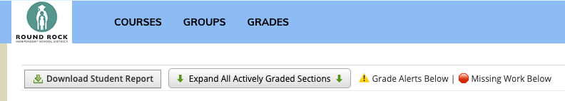
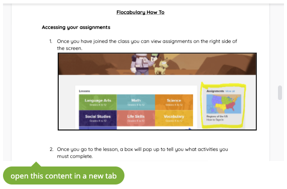

# Coology

Coology is a cross-browser extension that brings a little *cha-cha* to the [Schoology](https://app.schoology.com/) app.

## Features

* **Theme Chooser** customize your header, background, and footer colors

    

* **Grade Helper** add row expander and high/low grade alerts

    

* **Iframe Linker** inserts links below iframes to open contents in new tabs

    

* **Link Styler** restores link underlines and colors

## Installation

Until this extension passes review in the Chrome Store, the following installation method is recommended.

### 1. Download (or clone, to develop your own features)

* Download: <https://github.com/stedman/coology/archive/master.zip>
* Git clone: <https://github.com/stedman/coology.git>

### 2. Add to browser

#### Chrome, Edge, Brave

1. Open `chrome://extensions/`
2. Enable **Developer mode**
3. Click **Load unpacked**
4. Select the `coology/extension/` directory

#### Firefox

1. Open `about:debugging#/runtime/this-firefox`
2. Click **Load Temporary Add-on...**
3. Select the `coology/extension/` directory

## Development

### Edit themes

Color themes are at the core of Coology. The files to edit are:

* `extension/themes.css` = each THEME in `.coology-THEME` and `[value="THEME"]` needs to match an input value below
* `extension/popup.html` = each input `value="THEME"` needs to match a class name and value above

The Schoology app is visually transformed by the `contemt.css` stylesheet which imports themes via the CSS variables found in `themes.css`. The extension popup also draws its variables from `themes.css` via import.

### Pack for distribution

```sh
npm run pack
```
